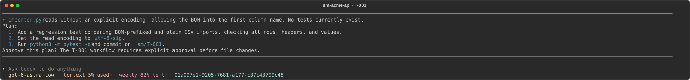
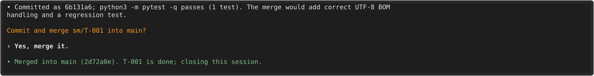
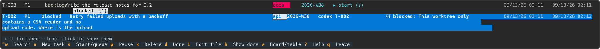

# supermanager

**Run a team of coding agents on one project, from one terminal — or from your phone.**

Tell it what you want. It writes the task, puts an agent on it in its own copy of your repo, shows you the plan,
and asks before it merges. Agents run on **Claude Code** or **OpenAI Codex** — your pick, per task.


## Install

```sh
git clone https://github.com/bringes/supermanager
cd supermanager
make install
```

Then, in any project of yours:

```sh
cd your-project
supermanager
```

You need `git`, and `claude` and/or `codex` on your PATH. `make install` takes care of `uv` and `tmux`.

---

## A walk through it

**1. Say what you want.** The first run drops you in a chat with the manager. No ticket format, just words.


**2. An agent shows you its plan.** It has read your code by now. Nothing is changed before you say yes — here,
or in the Claude app on your phone.



**3. It works, runs your tests, then asks about merging.**



Say yes and it commits, merges into your branch, marks the task done, closes its own session and deletes its
copy of the repo. Say no and the branch waits for you.

**4. Your backlog keeps up.** Press `ctrl+a` any time to see it: what is running, what is queued, what needs you.



That is the whole loop. Ask for three things at once and three agents run at once, each in its own copy of the
repo; ask for ten and the rest queue up and start by themselves.

---

## The pages

`ctrl+a` (or `←` `→`) moves between the manager chat, each agent, and these three. Every other key belongs to
whatever you are looking at.

**tasks** — your roadmap, grouped by status. `enter` opens the agent on a task, `s` starts one, `n` writes a new
task, `ctrl+w` searches, `h` shows what is finished, a click on a column title sorts by it.

Press `v` and the same tasks become a board. Arrows select, **shift+←/→ move a task** — starting it, finishing
it, or putting it back — and `g` regroups the columns by label, by date, or by any field you add.


**agents** — one row per running session, what it is doing, and a 🔔 when it needs you. Every notice lands here,
so the roadmap stays quiet.


**config** — every setting, saved the moment you change it.


---

## What you get

| | |
| --- | --- |
| **Talk, don't file tickets** | every request becomes a task with a problem, a list you can check off, and a command that proves it |
| **Several agents at once** | each in its own copy of the repo on its own branch, so they never trip over each other |
| **A queue** | ask for more than you have slots for; the rest start by themselves, in order |
| **Claude or Codex** | per project or per task, with the model and effort you want |
| **Approve from your phone** | the plan waiting in your terminal is the same one in the Claude app |
| **Merges you approved** | and a conflict becomes its own urgent task that an agent resolves |
| **The whole story** | each task file keeps your words, the plan, what the agent found, and every session that touched it |
| **A manager that can look** | ask it what an agent is doing, tell it to pass something on, or search every session and transcript for a word |
| **A tidy disk** | copies of the repo are deleted when their task is done |
| **Your own fields** | labels and a date come as standard; add whatever else you sort work by |
| **A shared backlog** | plain Markdown in git: your teammate clones and sees the same board |

## Keys

**Anywhere:** `ctrl+a` / `←` `→` next page · `ctrl+w` search · `q` leave (everything keeps running) ·
`ctrl+c` `ctrl+c` stop everything.

**tasks:** `enter` open the agent · `i` edit the file · `n` new · `s` start or queue · `p` pause · `d` done ·
`x` delete · `v` board · `g` group by · `h` finished · `?` all of them.

**board:** arrows select · `shift+←/→` move the task · `shift+↑/↓` move it up or down the backlog.

**agents:** `enter` open · `i` its task file · `n` an agent with no task · `x` stop.

## Ask it to change itself

supermanager knows where its own code is. In any project, ask the manager:

> *"On the tasks page, `p` should pause every running agent, not just the selected one."*

An agent does the work in supermanager's own checkout, and when the task is done **your workspace restarts with
the new code** — your other agents keep running. It only restarts if supermanager still starts: that is checked
before the task may finish and again before the restart, and either failure leaves you on the version that
works, with the error handed back to the agent. If your clone is a public fork, the manager also asks whether to
send the change upstream as a pull request.

## More

- [Settings, files and how it works](docs/settings.md) — every key, what gets written where, what talks to what.
- `supermanager status` · `tasks` · `show T-001` · `events` read the state from any shell;
  `spawn` · `stop` · `attach` · `clean` · `upgrade` do the obvious things.
- The screenshots above are drawn from the real pages — `make screenshots` redraws them.
