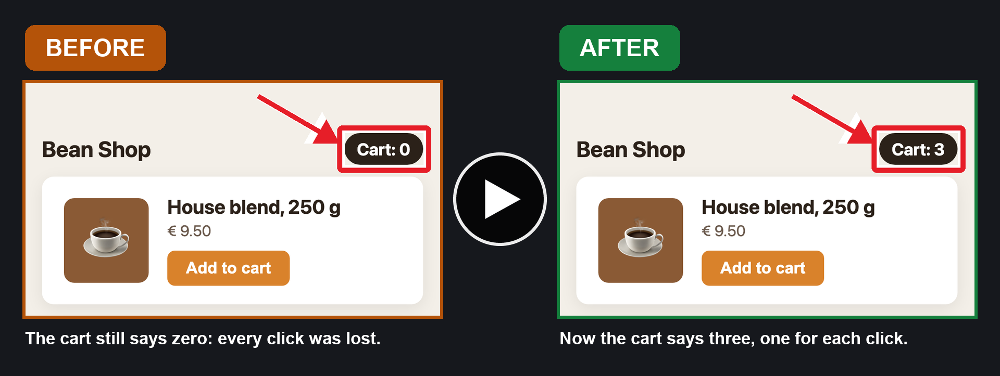

# better-tasks

**Delegate tasks to Claude. Get a before/after video of each fix. Approve it or ask for changes.**

A plugin for Claude Code: your tasks live as Markdown files in your project, a team of Claude agents works on them, and you only review the result.

[](https://cdn.jsdelivr.net/gh/iosifnicolae2/better-tasks@main/docs/videos/sample-before-after.mp4)

<sub>What a teammate hands in with a fix: an "Add to cart" button that lost every click, before and after. Click for the video; turn the sound on, the subtitles are read aloud.</sub>

## How it works

| 1. You ask | 2. Claude works | 3. You review |
|---|---|---|
| "Add a task: the cart button does nothing." | The lead hands the task to a teammate agent. It fixes it, tests it, records a before/after video, opens a PR. | You watch the video, then pick **Mark as resolved** or **Request changes**. |

## ✨ Features

- 📝 **Tasks as Markdown**: plain files in `.claude/tasks/`, committed with your code.
- 🤖 **A team of agents**: a lead routes each task to a teammate; teammates work in parallel.
- 🎥 **Before/after videos**: short, narrated, with boxes and arrows on what changed.
- ✅ **You approve**: no task closes without your yes.
- 🔀 **Your git flow**: straight to main, a shared `dev` branch, or a worktree and PR per task. Asked once per project.
- 🗂️ **Sprint board**: `/better-tasks` shows sprints, goals, the backlog and search.
- 🌙 **`/away`**: screens off, the Mac keeps working.

<p align="center">
  
</p>

## 📦 Install

```sh
claude plugin marketplace add iosifnicolae2/better-tasks
claude plugin install better-tasks@better-tasks
```

Restart Claude Code. Optional tools: `brew install ffmpeg uv` for videos, `gh` for pull requests.

<details>
<summary>Install for one project only</summary>

Run inside the project folder:

```sh
claude plugin marketplace add iosifnicolae2/better-tasks --scope project
claude plugin install better-tasks@better-tasks --scope project
```

This is saved in `.claude/settings.json`: commit it. Each teammate still runs the install once. `--scope local` is only you, only this project (not committed).
</details>

## 🚀 First use

1. **Add a task**: tell Claude what you want, e.g. *"Add a task: the cart button does nothing."*
2. **Start it**: *"Start T-001."* Claude asks your git flow once, then a teammate takes it.
3. **Review it**: when it is done, Claude shows the video and the PR and asks: **Mark as resolved** or **Request changes** (or type your own answer).

Open the board any time with `/better-tasks`.

## ✅ How approval works

- Claude asks about **one finished task at a time**.
- With a pull request, it **opens the PR in your browser** first (setting `openPrInBrowser`, on by default).
- **Mark as resolved** closes the task. **Request changes**: your words go to the same teammate, who pushes to the same PR.

## ⚙️ Settings

`/better-tasks config` (or `c` on the board), Claude Code's `/config`, or per project in `.claude/tasks/config.json`.
Git flow, teammate models, videos, your PR template, your own instructions for every task, and more. Every setting, its choices and default: [skills/settings/SKILL.md](skills/settings/SKILL.md). Or just ask Claude what you can configure.

Project rules for every task: ask *"set up better-tasks for this project"*, then edit the files in `.claude/tasks/`.

## 🔄 Update / uninstall

```sh
claude plugin marketplace update better-tasks
claude plugin update better-tasks@better-tasks
```

Restart Claude Code. Updates bring the latest [release](https://github.com/iosifnicolae2/better-tasks/releases), not every commit on main.

<details>
<summary>Uninstall</summary>

```sh
claude plugin uninstall better-tasks@better-tasks
claude plugin marketplace remove better-tasks
```

Installed per project? Add `--scope project` to `update` and `uninstall`.
</details>

## 🛠️ Contributing

Ask Claude for the change: it forks this repo, tries it as a linked install, then offers to open a PR here. Details and dev commands: [CONTRIBUTING.md](CONTRIBUTING.md).
