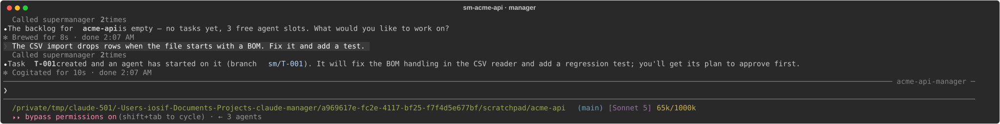
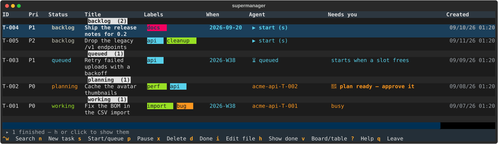
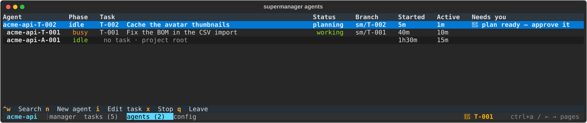
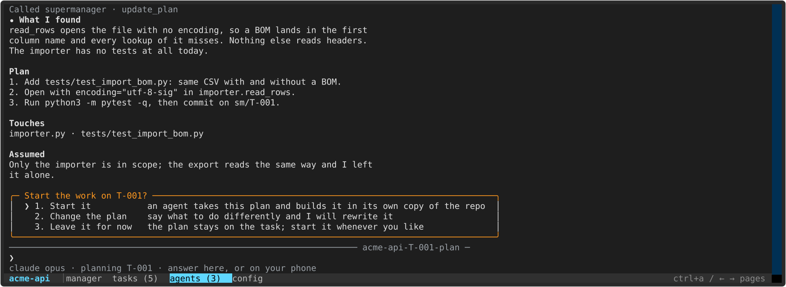
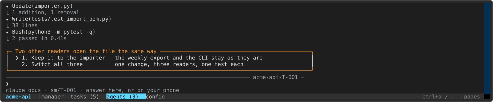
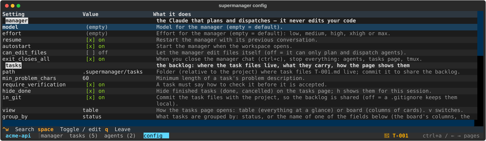

# supermanager

**Run a team of coding agents on one project, from one terminal — or from your phone.**

Tell it what you want. It writes the task, reads your code and plans it, asks you what is unclear, then puts an
agent on it in its own copy of your repo and asks before it merges. Agents run on **Claude Code** or
**OpenAI Codex** — your pick, per task.


## Install

```sh
git clone https://github.com/bringes/supermanager
cd supermanager
make install
```

Then, in any project of yours:

```sh
cd your-project
supermanager
```

You need `git`, and `claude` and/or `codex` on your PATH. `make install` takes care of `uv` and `tmux`.

---

## A walk through it

**1. Say what you want.** The first run drops you in a chat with the manager. No ticket format, just words.



**2. It writes the task and puts a planner on it.** `ctrl+a` any time shows your backlog: what is running,
what is queued, what needs you. T-001 is the one it just wrote.



**3. One row per session.** Every notice lands on the agents page — a 🔔 next to whoever is waiting for you —
so the roadmap stays quiet. Sessions you start yourself are here too: 📱 from the Claude app, 💻 in a terminal.



**4. The planner comes back with a plan.** It has read your code by now, and asked you anything it could not
work out from the code alone. What it found, the steps, the files it touches, what it assumed — short enough to
read on a phone, which is where you often will. Nothing is changed before you say start, here or in the Claude
app. Then a fresh agent takes that plan and builds it in its own copy of the repo.



**5. It works, and stops for what only you can answer.**



Then it runs your tests and reports. From there supermanager closes the task out: it commits, merges into your
branch, marks the task done, closes the session and deletes its copy of the repo. One setting
(`agents.on_finish`) makes that ask you first instead, or leaves every branch for you to merge by hand.

**6. How much happens without you is a setting.** One tab per section, saved the moment you change it. `←` `→`
step through the values a setting can take. The `auto` tab is where you hand steps over: nothing is, by default.



That is the whole loop. Ask for three things at once and three agents run at once, each in its own copy of the
repo; ask for ten and the rest queue up and start by themselves.

---

## The pages

`ctrl+a` (or `←` `→`) moves between the manager chat, each agent, and these three. Every other key belongs to
whatever you are looking at.

**tasks** — your roadmap, grouped by status, the work that is on at the top and the backlog at the bottom.
`enter` opens the agent on a task, `s` starts one, `n` writes a new task, `ctrl+w` searches, `h` shows what is
finished, a click on a column title sorts by it.

Press `v` and the same tasks become the board at the top of this page. Arrows select, **shift+←/→ move a task**
— starting it, finishing it, or putting it back — shift+↑/↓ move it inside its column, and `g` regroups the
columns by label, by date, or by any field you add. **Or drag a card with the mouse:** hold it and the column
under the pointer lights up with a line where it will land. Cards stay in the order you put them in.

**agents** — one row per running session, what it is doing, and a 🔔 when it needs you. supermanager runs
Claude's Remote Control for the project, so it is in the Claude app under the project's name: a session you
start there works in this project and shows up here with the rest.

**config** — a tab per section: `manager`, `tasks`, `agents`, `auto`, `remote`, `notify`. A switch flips with `enter`, a
setting whose values are a set lists them and steps through them with `←` `→`, anything else opens a line to
type in. `ctrl+w` searches every section at once.

---

## What you get

| | |
| --- | --- |
| **Talk, don't file tickets** | every request becomes a task with a problem, a list you can check off, and a command that proves it |
| **Several agents at once** | each in its own copy of the repo on its own branch, so they never trip over each other |
| **Nothing stops to ask** | agents run with every permission granted, so a task does not sit waiting for a yes while you are away |
| **A queue** | ask for more than you have slots for; the rest start by themselves, in order |
| **Planned before it is built** | every task gets a planner that reads the code and asks you what it cannot work out; the agent that does the work starts from that plan |
| **Questions that find you** | a planner or an agent asks with options to pick, in the terminal or in the Claude app |
| **As hands-off as you like** | off by default: hand over starting work, approving plans, merging — one switch each, or all four at once |
| **Claude or Codex** | per project or per task, with the model and effort you want |
| **Approve from your phone** | the plan waiting in your terminal is the same one in the Claude app |
| **Your own sessions, too** | start a session in this project from the Claude app or a terminal and it shows on the agents page with the rest |
| **Finished means finished** | merged into your branch, the copy of the repo gone, the session closed — or it asks first, or leaves the branch for you: one setting |
| **Conflicts are work, not errors** | a merge that clashes becomes its own urgent task that an agent resolves |
| **The whole story** | each task file keeps your words, the plan, what the agent found, and every session that touched it |
| **A manager that can look** | ask it what an agent is doing, tell it to pass something on, or search every session and transcript for a word |
| **What it cost, per task** | tokens and dollars counted from each session's own transcript; give a task a budget and say what happens when it runs out |
| **A manager with the controls** | "pause T-003", "tell it to carry on", "stop everything" — it pauses, resumes and kills agents for you, one or all of them |
| **Walk away from it** | the computer is held awake — lid shut too — so the agents keep going; say "lights out" and the screen goes black, bell and all, until you press a key |
| **A tidy disk** | copies of the repo are deleted when their task is done |
| **Your own fields** | labels and a date come as standard; add whatever else you sort work by |
| **A shared backlog** | plain Markdown in git: your teammate clones and sees the same board |

## Keys

**Anywhere:** `ctrl+a` / `←` `→` next page · `ctrl+w` search · `q` leave (everything keeps running) ·
`ctrl+c` `ctrl+c` stop everything.

**tasks:** `enter` open the file · `o` open the agent · `n` new · `s` start or queue · `p` pause · `d` done ·
`x` delete · `v` board · `g` group by · `h` finished · `?` all of them.
With the mouse: a click opens the file, a click on **Agent** or **Needs you** opens that agent — or starts one.

**board:** arrows select · `shift+←/→` move the task to another column · `shift+↑/↓` move it inside one ·
drag a card to do either with the mouse.

**agents:** `enter` open · `i` its task file · `n` an agent with no task · `x` stop.

**config:** `tab` next section · `enter` flip a switch or type a value · `←` `→` the values a setting can take.

## Ask it to change itself

supermanager knows where its own code is. In any project, ask the manager:

> *"On the tasks page, `p` should pause every running agent, not just the selected one."*

An agent does the work in supermanager's own checkout, and when the task is done **your workspace restarts with
the new code** — your other agents keep running. It only restarts if supermanager still starts: that is checked
before the task may finish and again before the restart, and either failure leaves you on the version that
works, with the error handed back to the agent. If your clone is a public fork, the manager also asks whether to
send the change upstream as a pull request.

## More

- [Settings, files and how it works](docs/settings.md) — every key, what gets written where, what talks to what.
- `supermanager status` · `tasks` · `show T-001` · `events` read the state from any shell;
  `spend` shows what it has all cost;
  `spawn` · `pause` · `resume` · `stop` · `attach` · `clean` · `screen-off` · `upgrade` do the obvious things
  (`pause all` and `stop all` take every running agent at once).
- The screenshots above are drawn from the real pages — `make screenshots` redraws them.
