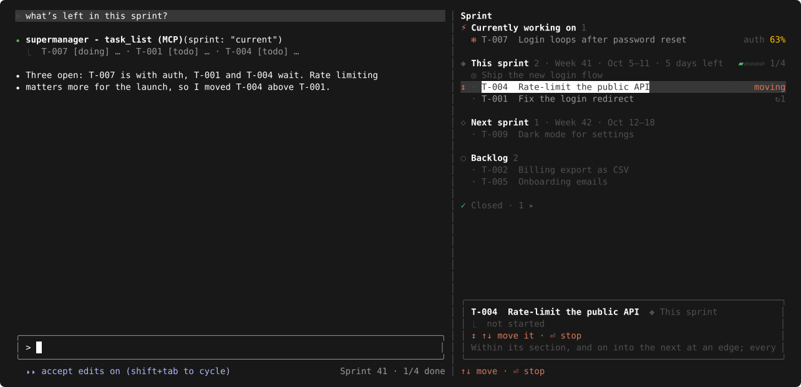
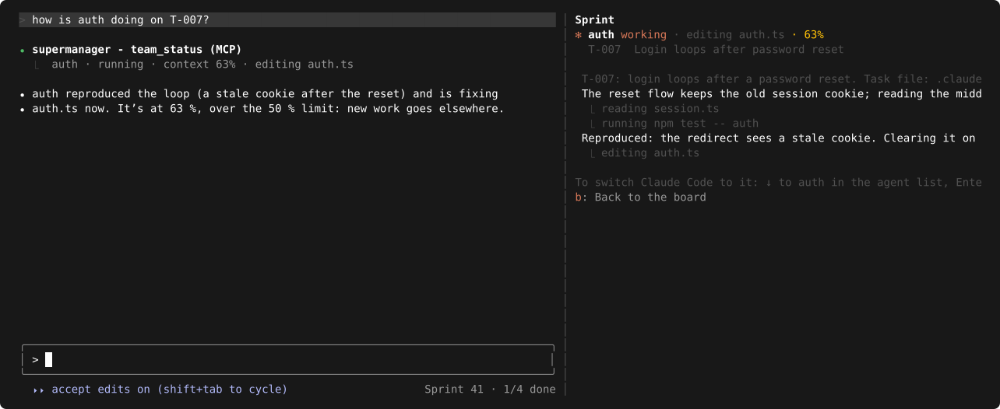
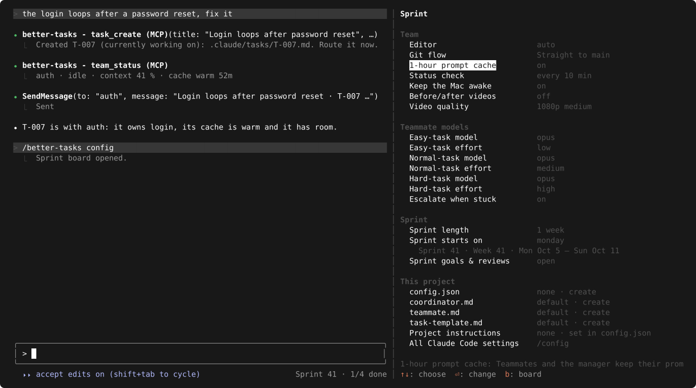

# supermanager

**Run a team of Claude Code agents in weekly sprints, from one session.**

Claude Code mod · TypeScript · no dependencies · macOS

<p align="center">
  
</p>

Your main session becomes a **manager** that hands work to agent **teammates**, keeps **tasks** in **sprints**,
and shows them on a **board**. For people who run several agents on one project and want them organized.

> It replaces the earlier Python app (daemon, tmux, dashboard).

&nbsp;

## What it does

- 🧭 **Manager.** You talk to the main session. It routes each message to the teammate that owns that area.
- 👥 **Teammates.** New work gets a teammate named by its area (`auth`, `billing`). Similar work goes back to the same one.
- 🗓️ **Sprints.** 1 week by default (up to 4). One goal per sprint, unfinished work rolls over, a short review at the end.
- 📋 **Tasks and board.** A new task asks *Start now (currently working on) / This sprint / Next sprint / Backlog*. `/supermanager` shows them all.
- 🧠 **Context-aware routing.** A teammate above 50 % context gets no new work: it writes a handoff note, a fresh one takes over.
- 🌙 **Screens off.** `/away` blacks out the screens; the Mac keeps working and doesn't lock.
- 🧩 **Per project.** Numbering, paths, the manager's rules, teammate instructions and the task template live in `.claude/manager/`.

&nbsp;

## 📦 Install

**Needs**

- Claude Code **2.1.288** or newer. Mods are early access; the API may change between releases. Check with `claude --version`.
- Access to the private repo `iosifnicolae2/supermanager`, and git able to reach GitHub (an ssh key, or `gh auth setup-git`).
- macOS for `/away` and keep-awake (`caffeinate`, `osascript`).
- Teammates in the same process (`teammateMode: in-process`). In tmux mode the board can't see their context fill.

**Install**

```sh
claude plugin marketplace add iosifnicolae2/supermanager
claude plugin install supermanager@supermanager
```

Then start `claude`. The settings have defaults, so the install's "options not yet set" note needs nothing.

**First run**

1. The mod needs agent teams. If they are off, it stays off and asks Claude to add
   `"CLAUDE_CODE_EXPERIMENTAL_AGENT_TEAMS": "1"` to the `env` block of `~/.claude/settings.json`. You approve the edit.
2. Restart the session: exit, start `claude` again.

If the flag is already in settings, the status line only says to restart.

**Update**

```sh
claude plugin marketplace update supermanager
claude plugin update supermanager@supermanager
```

Restart the session to use the new version.

**Uninstall**

```sh
claude plugin uninstall supermanager@supermanager
claude plugin marketplace remove supermanager
```

Optional: delete `.claude/manager/` in your projects (tasks, sprints, overrides).

&nbsp;

## 🔄 How it works

```
 you ──▶ manager (main session)
           │  "which sprint?" → .claude/manager/tasks/T-001-fix-login.md
           ▼
         teammate "auth" ── works, keeps notes in its task file
           │  board: working · editing auth.ts · 34 %
           ▼
         done ──▶ row in docs/tasks.md · sprint review in .claude/manager/sprints.md
```

1. You ask for something. The manager checks who owns that area (`team_status`) and forwards it, or creates a task.
2. A task file is written: frontmatter (`sprint`, `status`, `owner`, `order`, …), then Goal and Notes.
3. Starting a task hands it to a teammate with the task file's path. `teammate.md` instructions go into its prompt.
4. The board and the footer (`Sprint 41 · 1/4 done`) follow every change. Each prompt gives the manager the sprint, due work and each teammate's context fill.
5. Done: the task moves to "✓ Closed" and a row goes into `docs/tasks.md`. At the sprint's end open work rolls over and `sprints.md` gets the review.

**Files, per project** (defaults; `config.json` can move them)

| path | what |
| --- | --- |
| `.claude/manager/tasks/` | one file per task |
| `.claude/manager/sprints.md` | each sprint's goal and review |
| `docs/tasks.md` | one row per finished task |
| `.claude/manager/config.json`, `*.md` | your overrides |

&nbsp;

## ⌨️ Using it

Just talk to the main session:

- "create a task to fix the login redirect" → it asks when.
- "set the sprint goal: ship login" · "go" (work this sprint in order) · "start T-003" · "plan T-003 first" (it plans, you approve).
- "I'm leaving, turn the screen off" → `/away`.

Each session opens with a few dim tip lines. The model never reads them.

### 📋 The board

`/supermanager` opens it. Click it, or press `ctrl+x tab`, to give it the keys.

<table>
  <tr>
    <td></td>
    <td></td>
  </tr>
  <tr>
    <td align="center"><sub><code>enter</code>: the task's actions</sub></td>
    <td align="center"><sub><code>m</code>: move mode</sub></td>
  </tr>
</table>

| key | does |
| --- | --- |
| `↑` `↓` | select a task |
| `enter` / click | the task's actions: `←` `→` choose, `enter` runs, `↑` back to the list |
| `o` | open the task file in your editor |
| `s` | start: the manager hands it to a teammate |
| `d` | mark as done |
| `v` | view the teammate's session (`b` back) |
| `m` | move: `↑` `↓` carry the task (into the next section at an edge), `enter` stops |
| `⌥↑` `⌥↓` | move one place directly |
| `b` | backlog ↔ this sprint |
| `r` | reopen a closed task (open "✓ Closed" with `enter` or a click) |
| `c` | settings page (`b` back) |

Sections: ⚡ Currently working on · ◆ This sprint · ◇ Next sprint · ○ Backlog · ✓ Closed.

- **IntelliJ terminal:** for `⌥↑` `⌥↓`, turn on *Settings › Tools › Terminal › Use Option as Meta key*.
- **Docking:** on the right only in the fullscreen layout with 110+ columns; otherwise it opens above the prompt.

**View session** (`v`) shows the teammate's live transcript:

<p align="center">
  
</p>

### ⚙️ Settings

`c` on the board, or `/supermanager config`. One row per setting; `enter` changes it.
The same rows are in `/config` as "Supermanager: …".

<p align="center">
  
</p>

| setting | default | what |
| --- | --- | --- |
| Editor | `auto` | opens task files: `auto` (the IDE you run in, else the default app), `default`, `code`, `idea`, `cursor`, `zed` |
| Worktree per teammate | off | each named teammate gets its own git worktree |
| Context limit | 50 % | above it a teammate gets no new work |
| Keep the Mac awake | on | holds `caffeinate` while a teammate works |
| Sprint length | 1 week | 1 to 4 weeks; a change re-files open tasks, nothing is lost |
| Sprint starts on | Monday | any weekday |

The "This project" part shows which values come from the project, and opens or creates its override files.

### 🌙 Screens off

`/away`, or ask. Every screen goes black; the Mac stays awake and unlocked. Move the mouse or press a key to come back.

&nbsp;

## 🧩 Customize per project

All in `<project>/.claude/manager/`. Ask Claude to "set up supermanager for this project" (`project_init`) for starter files.
Existing files are never overwritten.

| file | what |
| --- | --- |
| `config.json` | any setting above, plus `taskPrefix` (`T-`), `taskPadding` (3), `taskStart` (1), `taskFileName` (`{id}-{slug}.md`), `tasksFolder`, `logFile`, `sprintsFile`. Wins over `/config`. Keys starting with `//` are off. |
| `coordinator.md` | the manager's rules |
| `teammate.md` | added to every teammate's prompt |
| `task-template.md` | a new task's body: `{goal}`, `{title}`, `{id}`, `{created}` |
| `tips.md` | the startup tips |

- A text file **replaces** the built-in text. A first line `<!-- extend -->` **adds** to it instead.
- `<!-- comments -->` never reach the model.
- A bad key gives one dim line at startup and is skipped. Files you don't override follow the mod's updates.

&nbsp;

## 🛠️ Development

Run a working copy instead of the installed one:

```sh
claude --plugin-dir ~/path/to/supermanager   # this session only; saving a file reloads the mod
```

```sh
claude plugin validate .   # the marketplace manifest
claude plugin validate .claude-plugin/plugin.json   # the plugin and its hooks module
claude plugin test .       # tests/*.test.ts(x)
tsc -p .                   # types: the engine lays .claude-plugin/types/ and a tsconfig.json here when it loads the mod
```

Screenshots are drawn from the real pane in the test kit: `node scripts/screenshots.mjs` runs the tests, takes the pane's trees from `tests/screenshots.test.ts` and rewrites `docs/screenshots/*.svg`.

The validator's rules: `$` never crosses an import; state refs are declared in the file that uses them; one `session.start` without a matcher.

| file | job |
| --- | --- |
| `.claude-plugin/plugin.json` | manifest, `/config` settings |
| `.claude-plugin/marketplace.json` | makes the repo its own marketplace |
| `types/index.d.ts` | task, teammate and state types |
| `hooks/register.tsx` | wires every core hook; builds the `io` the parts use |
| `hooks/settings.ts` | settings: defaults < `/config` < `config.json` |
| `hooks/texts.ts` | shipped texts, overrides, `project_init` |
| `hooks/tasks.ts` · `taskflow.ts` | task files · changing, finishing, logging them |
| `hooks/sprints.ts` · `sprintlog.ts` · `boundary.ts` | sprint dates and labels · `sprints.md` · roll-over |
| `hooks/coordinator.ts` · `tools.ts` · `team.ts` | manager rules and context · the model's tools · teammates |
| `hooks/setup.ts` · `tips.ts` | first-run agent-teams setup · startup tips |
| `hooks/pane.tsx` · `board.tsx` · `configpage.tsx` · `sessionview.tsx` | the board, its settings page, the session view |
| `hooks/activity.ts` · `editor.ts` · `spinner.tsx` | what a teammate is doing · which editor opens · spinners |
| `hooks/screen.ts` · `bin/away.sh` · `bin/blackout.js` | `/away` and keep-awake |
| `tests/` | `claude plugin test` suites |
| `scripts/screenshots.mjs` · `docs/screenshots/` | the README pictures |
| `docs/tasks.md` | this repo's finished-task log |
