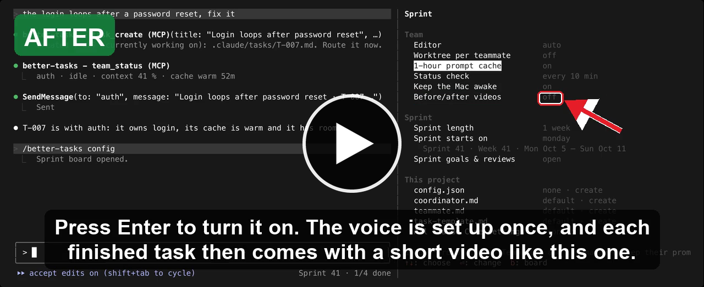

# better-tasks

**Plan and track tasks inside Claude Code, kept as plain Markdown files in your project.**

<p align="center">
  
</p>

## 📦 Install

**For you, in every project** (default, recommended):

```sh
claude plugin marketplace add iosifnicolae2/better-tasks
claude plugin install better-tasks@better-tasks
```

**For one project only**, run inside the project folder:

```sh
claude plugin marketplace add iosifnicolae2/better-tasks --scope project
claude plugin install better-tasks@better-tasks --scope project
```

- Project scope: saved in `.claude/settings.json`; commit it. Each teammate still runs the install once.
- `--scope local`: only you, only this project (`.claude/settings.local.json`, not committed).

Restart Claude Code.

## ✨ Features

- 📝 **Tasks as Markdown** in your project, committed with your code.
- 🗂️ **Sprint board** (`/better-tasks`): sprints with a goal, backlog, search.
- 🤖 **A team of agents:** the lead hands each task to a teammate.
- ✅ **You approve** finished work before a task closes.
- 🎥 **Before/after videos** of each change, narrated.
- 🔀 **Your git flow, asked once per project:** straight to main; a shared `dev` branch with a pull request per task (one build, one install for everything); or a worktree and pull request per teammate. Recommended from a quick look at the project.
- 📝 **PR descriptions from a template:** the project's own (`.github/pull_request_template.md` and the other places GitHub and GitLab look), a path of your choice (`prTemplate` in `.claude/tasks/config.json`), else better-tasks' short one: the request and why on top, then the video, what changed, how to test. The settings page's "PR template" row adds it to your repo when you press Enter.
- 📌 **Your own instructions** for every task: point `instructions` in `.claude/tasks/config.json` at a file or folder; prompts carry its path and first line.
- 🧘 **A quiet IDE:** with teammates in worktrees, an IntelliJ project is asked once whether IntelliJ may skip them (`.claude/worktrees/`), so they don't set off re-indexing; the answer is `excludeWorktreesFromIde` in `.claude/tasks/config.json`.
- 🌙 **`/away`:** screens off, the Mac keeps working.

### 🎬 Demo: a before/after video

A video better-tasks made of its own change: the settings page before and after the "Before/after videos" row. Turn the sound on: the subtitles are read aloud.

[](https://cdn.jsdelivr.net/gh/iosifnicolae2/better-tasks@24f713a11783dd8ccc503f74adad448c4108aa79/docs/videos/before-after.mp4)

## 🔄 Update / uninstall

**Update:**

```sh
claude plugin marketplace update better-tasks
claude plugin update better-tasks@better-tasks
```

Then restart Claude Code. Updates bring the latest [release](https://github.com/iosifnicolae2/better-tasks/releases), not every commit on main; `claude plugin list` shows the installed version.

**Uninstall:**

```sh
claude plugin uninstall better-tasks@better-tasks
claude plugin marketplace remove better-tasks
```

Installed per project? Add the same `--scope project` to `update` and `uninstall`.

## 🧩 More

- **Settings:** `/better-tasks config` (or `c` on the board), Claude Code's `/config`, or per project in `.claude/tasks/config.json`. Every setting, its choices, default and where it lives: [skills/settings/SKILL.md](skills/settings/SKILL.md); Claude loads it when you ask what you can configure.
- **Optional tools:** before/after videos need `ffmpeg` and `uv` (`brew install ffmpeg uv`); pull requests need `gh`; the shared-dev-branch flow uses `python3`.
- **Project setup:** ask "set up better-tasks for this project", then edit the files in `.claude/tasks/`.
- **Changing better-tasks:** ask Claude for the change. It forks this repo, makes the change there, runs the fork as a linked install (an edit applies on `/reload-plugins`, no reinstall), then asks whether to open a PR here: Yes, Not now or Never (kept per user in `~/.claude/better-tasks/user.json`).
- **Development:** `claude --plugin-dir .` runs this copy; `claude plugin test .` runs the tests; `bun scripts/yaml-check.ts [tasks folder]` checks task front matter with real YAML parsers (Ruby's Psych, as GitHub uses, and Bun.YAML); `sh scripts/video-branch-check.sh` checks the video links bin/video-branch.sh prints; `bun scripts/settings-doc.ts` regenerates the settings skill after a setting changes (`--check` says whether it is current).
