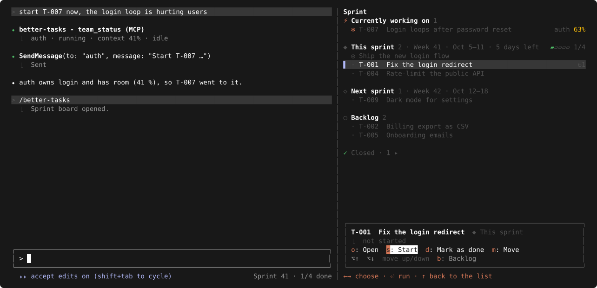

# supermanager

**Plan and track tasks inside Claude Code, kept as plain Markdown files in your project.**

Claude Code mod · TypeScript · no dependencies · macOS

<p align="center">
  
  <br><sub>Claude Code with the Sprint board docked on the right</sub>
</p>

&nbsp;

## 📝 Tasks

1. **Ask:** "create a task to fix the login redirect".
2. **Pick when:** Claude asks *Start now (currently working on) / This sprint / Next sprint / Backlog*. Nothing starts on its own.
3. **It's a file:** `.claude/manager/tasks/T-001-fix-login-redirect.md`. Edit it in any editor; the board picks up the change.
4. **See them:** `/supermanager` opens the board.
5. **Work them:** start, move, mark as done, from the board or by asking ("start T-001", "move T-002 to next sprint").
6. **Done:** the task moves to "✓ Closed" and gets a row in `docs/tasks.md`.

A task file:

```markdown
---
id: T-001
title: Fix login redirect
sprint: 2026-10-05
urgent: false
status: doing
owner: auth
rolled: 0
order: 0
created: 2026-10-03
---
## Goal
Users land on /home after login, not on the page they asked for.

## Notes
- 2026-10-04: the redirect drops the `next` param in middleware.ts
```

`sprint`: the sprint's start date, or `backlog` · `urgent: true`: currently working on · `status`: todo, doing, done, cancelled · `rolled`: sprints it was carried over.

&nbsp;

## 🗓️ Sprints

- 1 week by default (up to 4), starting Monday: `Sprint 41 · Week 41 · Mon Oct 5 – Sun Oct 11 · 3 days left`.
- One goal per sprint: "set the sprint goal: ship login".
- At the end: open tasks roll over, and `.claude/manager/sprints.md` gets a review (shipped, rolled over).

## 👥 Teammates

- Starting a task hands it to a Claude Code teammate named by its area (`auth`, `billing`), with the task file's path.
- The board shows what it's doing and how full its context is: `working · editing auth.ts · 34%`.
- Above 50 % context it gets no new work: it writes a handoff note in the task file, and a fresh teammate takes over.

&nbsp;

## 📦 Install

Needs Claude Code **2.1.288+**, access to the private repo `iosifnicolae2/supermanager` (git over ssh or `gh auth setup-git`), and macOS for `/away`.

```sh
claude plugin marketplace add iosifnicolae2/supermanager
claude plugin install supermanager@supermanager
```

**First run:** the mod needs agent teams. Claude offers to add `"CLAUDE_CODE_EXPERIMENTAL_AGENT_TEAMS": "1"` to `~/.claude/settings.json` (you approve), then restart `claude`.

**Update**, then restart:

```sh
claude plugin marketplace update supermanager
claude plugin update supermanager@supermanager
```

**Uninstall:**

```sh
claude plugin uninstall supermanager@supermanager
claude plugin marketplace remove supermanager
```

&nbsp;

## ⌨️ Board keys

Click the board or press `ctrl+x tab` to give it the keys.

| key | does |
| --- | --- |
| `↑` `↓` | select |
| `enter` | the task's actions (`←` `→` choose, `enter` runs, `↑` back) |
| `o` · `s` · `d` | open in your editor · start · mark as done |
| `m` | move: `↑` `↓` carry it, `enter` stops |
| `⌥↑` `⌥↓` | move one place |
| `b` | backlog ↔ this sprint |
| `v` | the teammate's session |
| `r` | reopen a closed task |
| `c` | settings |

<p align="center">
  
  <br><sub>Enter on a task: its actions take the keys</sub>
</p>

In IntelliJ's terminal, `⌥↑` `⌥↓` need *Settings › Tools › Terminal › Use Option as Meta key*.

## ⚙️ Settings

`c` on the board, `/supermanager config`, or `/config`.

| setting | default |
| --- | --- |
| Editor (opens task files) | `auto`: the IDE you run in, else the default app |
| Worktree per teammate | off |
| Context limit | 50 % |
| Keep the Mac awake while teammates work | on |
| Sprint length | 1 week (1–4) |
| Sprint starts on | Monday |

🌙 `/away` turns the screens off while the Mac keeps working.

&nbsp;

## 🧩 Customize per project

In `<project>/.claude/manager/`. Ask "set up supermanager for this project" for starter files.

| file | changes |
| --- | --- |
| `config.json` | any setting, plus task ids (`taskPrefix` `T-`, `taskPadding` 3, `taskStart` 1), `taskFileName`, and where files go (`tasksFolder`, `sprintsFile`, `logFile`) |
| `task-template.md` | a new task's body (`{goal}`, `{title}`, `{id}`, `{created}`) |
| `teammate.md` | instructions added to every teammate |
| `coordinator.md` | the manager's rules |
| `tips.md` | the startup tips |

A text file replaces the built-in one; a first line `<!-- extend -->` adds to it instead.

&nbsp;

## 🛠️ Development

```sh
claude --plugin-dir .                                  # run this working copy for one session
claude plugin validate .claude-plugin/plugin.json      # the plugin and its hooks
claude plugin test .                                   # tests/; screenshots: node scripts/screenshots.mjs
```
