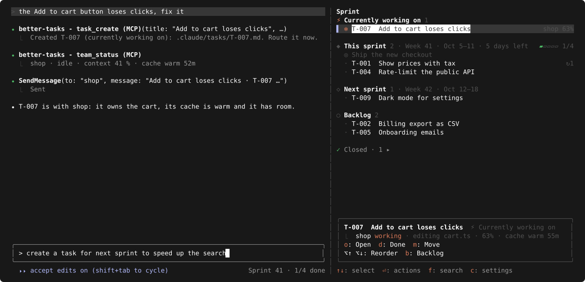

# better-tasks

**Plan and track tasks inside Claude Code, kept as plain Markdown files in your project.**

<p align="center">
  
</p>

## 📦 Install

**For you, in every project** (default, recommended):

```sh
claude plugin marketplace add iosifnicolae2/better-tasks
claude plugin install better-tasks@better-tasks
```

**For one project only**, run inside the project folder:

```sh
claude plugin marketplace add iosifnicolae2/better-tasks --scope project
claude plugin install better-tasks@better-tasks --scope project
```

- Project scope: saved in `.claude/settings.json`; commit it. Each teammate still runs the install once.
- `--scope local`: only you, only this project (`.claude/settings.local.json`, not committed).

Restart Claude Code.

## ✨ Use

- **"fix the login redirect"**: a task, saved as Markdown in `.claude/tasks/`, and a teammate starts on it now. Say "next sprint" or "backlog" to plan it instead.
- **`/better-tasks`**: the sprint board. Weekly sprints with a goal; open tasks roll over.
- **"start T-001"**: a teammate takes the task; the board shows what it's doing.
- **`/away`**: screens off, the Mac keeps working.
- **Before/after videos** (asked at first start; `/better-tasks config`): finished work comes with a short video, the bug then the fix, marked in red, subtitles read aloud by [Kokoro](https://github.com/hexgrad/kokoro). Needs `ffmpeg` and `uv` (`brew install ffmpeg uv`); the voice installs once under `~/.local/share/better-tasks/`.
- **PR per task** (asked at first start in a GitHub project; `/better-tasks config`): each teammate works in its own worktree and finishes with a GitHub pull request, its before/after video playing inside; approving the task merges it. Needs `gh`; when it's older than 2.99 (no video upload), better-tasks updates it with Homebrew.

## 🔄 Update / uninstall

**Update:**

```sh
claude plugin marketplace update better-tasks
claude plugin update better-tasks@better-tasks
```

Then restart Claude Code. Updates bring the latest [release](https://github.com/iosifnicolae2/better-tasks/releases), not every commit on main; `claude plugin list` shows the installed version.

**Uninstall:**

```sh
claude plugin uninstall better-tasks@better-tasks
claude plugin marketplace remove better-tasks
```

Installed per project? Add the same `--scope project` to `update` and `uninstall`.

## 🧩 More

- **Project setup:** ask "set up better-tasks for this project", then edit the files in `.claude/tasks/`.
- **Development:** `claude --plugin-dir .` runs this copy; `claude plugin test .` runs the tests; `bun scripts/yaml-check.ts [tasks folder]` checks task front matter with real YAML parsers (Ruby's Psych, as GitHub uses, and Bun.YAML).
